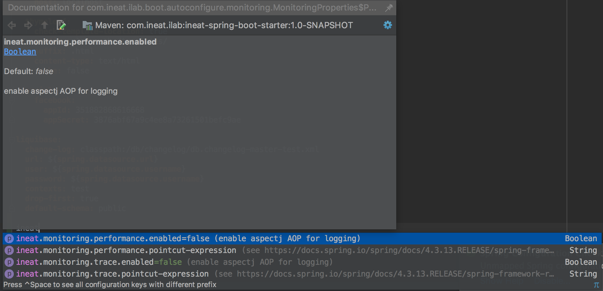

<p align="center">
  <a href="https://twitter.com/IneatLab">
    
  </a>
</p>

<h3 align="center">
 Ineat Lab Spring Boot Starter
</h3>

<p align="center">
  Set of AutoConfigurations for  <a href="https://projects.spring.io/spring-boot/">spring-boot</a>
</p>

[](https://maven-badges.herokuapp.com/maven-central/com.google.guava/guava)

## Why ?

The main idea of this library is to provide a set of Spring Boot AutoConfigurations for commons needs in business
 applications developments. 
 
## How to use this starter


The Maven group ID is `com.ineat-group.lab`, and the artifact ID is `ineat-spring-boot-starter`. 

To add a dependency using Maven, use the following:

```xml
<dependency>
  <groupId>com.ineat-group.lab</groupId>
  <artifactId>ineat-spring-boot-starter</artifactId>
  <version>LATEST</version>
</dependency>
```

To add a dependency using Gradle:

```
dependencies {
  compile 'com.ineat-group.lab:ineat-spring-boot-starter:+'
}
```

## List of available auto-configurations

> You can see all our available configurations in your favorite IDE by taping `ineat.` and using the auto-completion (ctrl + space)
> into your application.yaml/properties :
> 

### Monitoring

Inspired by [Baeldung spring-performance-logging article](http://www.baeldung.com/spring-performance-logging), this 
starter provides a fast way to register 

* a [Simple Trace Interceptor](https://docs.spring.io/spring-framework/docs/current/javadoc-api/org/springframework/aop/interceptor/SimpleTraceInterceptor.html)
to log in `TRACE` level each method invocation
* a [Performance Interceptor](https://docs.spring.io/spring-framework/docs/current/javadoc-api/org/springframework/aop/interceptor/PerformanceMonitorInterceptor.html)
to log **method execution delay** (usefull for example to monitoring your method execution time !)

**IMPORTANT** : Because of these interceptors logs at `TRACE` level, you need to set your spring `logging.level` property to
`TRACE` : 

```yaml
logging:
  level:
    com.ineat.lab.sample: TRACE

```

```yaml
logging:
  level:
    com.ineat.lab.sample: TRACE
      
ineat:
  monitoring:
    trace:
      enabled: true # easily use, or not the interceptor
      pointcut-expression: execution(* com.ineat.lab.sample.**(..)) # set the pointcut expression according to AspectJ pointcut pattern

```

Result on logs : 

```
2018-02-01 15:37:46.882 TRACE 3480 --- [nio-8080-exec-1] c.i.l.s.DemoApplication$SampleController : Entering method 'test' of class [com.ineat.lab.sample.DemoApplication$SampleController]
2018-02-01 15:37:46.884 TRACE 3480 --- [nio-8080-exec-1] c.i.l.s.DemoApplication$SampleController : Exiting method 'test' of class [com.ineat.lab.sample.DemoApplication$SampleController]


```
#### PerformanceMonitorInterceptor

```yaml
ineat:
  monitoring:
    performance:
      enabled: true # easily use, or not the interceptor
      pointcut-expression: execution(* com.ineat.lab.sample.*.*(..)) # set the pointcut expression according to AspectJ pointcut pattern
```


Result on logs : 

```
2018-02-01 15:39:29.975 TRACE 3480 --- [nio-8080-exec-1] c.i.l.s.DemoApplication$SampleController : StopWatch 'com.ineat.lab.sample.DemoApplication$SampleController.test': running time (millis) = 3


```

## Want to contribute ?

If you uses our starter-kit and you want to contribute by adding others commons use-cases/needs auto-configuration for 
spring-boot, send us a pull request with an explanation of your feature.